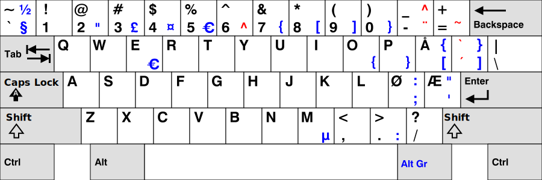

# norwerty



Taken from [tobiasvl/norwerty](https://github.com/tobiasvl/norwerty/)@`23022f5`. Some notes:

- The warnings seen when testing the Norwerty layout as described in [Custom XKB layouts](https://nixos.org/manual/nixos/stable/#custom-xkb-layouts) are the same as seen when testing against the default Norwegian layout, except for:

  ```
  Warning:          Symbol map for key <RALT> redefined
                    Using last definition for conflicting fields
  ```

  This is what I want.

- Did not do this:

  > 1. Add the contents of [`no.txt`](https://github.com/tobiasvl/norwerty/blob/master/linux/no.txt) to the end of the file `/usr/share/X11/xkb/symbols/no`

  Instead I added an `include "no(basic)"`.
